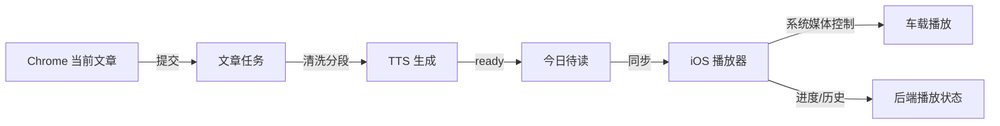

# web2audio 产品需求设计

Chrome 插件负责提交文章，服务端生成音频，iOS 播放器复用现有播放链路承接通勤和车载连续收听。

本文档用于产品评审和后续实现拆解，聚焦产品功能设计、系统边界、关键流程、验收标准与待确认项。

## 1. 背景与目标

### 背景

用户每天在 Chrome 浏览器中阅读大量文章，希望把其中值得消化的长文自动转成可收听音频，并在开车通勤时连续播放。当前诉求不是重新做一个泛用 TTS 工具，而是把「网页文章 -> 有声内容 -> 播放队列 -> 车上收听」串成稳定闭环。

### 产品目标

| 维度 | 第一版目标 |
| --- | --- |
| 使用场景 | 每天开车时收听平时在 Chrome 浏览过并主动保存的文章 |
| 用户范围 | 个人自用 MVP，优先跑通端到端体验 |
| 内容来源 | Chrome 当前网页文章，由插件提取正文并上传 |
| 播放入口 | love-song iOS 播放器，复用现有播放队列与播放历史能力 |

## 2. 竞品与关键模块调研

### 代表产品

| 产品 | 相关能力 | 对本方案的启发 |
| --- | --- | --- |
| [Readwise Reader](https://readwise.io/read) | 稍后读、浏览器扩展、多端同步、TTS、文章/Newsletter/PDF/EPUB 等内容管理 | 证明「统一阅读收集箱 + 听读」是成熟方向 |
| [Speechify](https://speechify.com/) | Chrome 扩展、移动端、网页/文档 TTS、高质量语音 | TTS 体验、语速和音色质量会直接影响通勤使用 |
| [Matter](https://hq.getmatter.com/) | 稍后读、文章收集、音频播放队列 | 「保存后进入可听队列」比单次 TTS 更符合用户习惯 |
| [Instapaper](https://www.instapaper.com/) | 一键保存、全设备同步、离线阅读 | 离线和跨端同步是长期体验基础 |

### 关键模块归纳

| 模块 | 能力说明 | 第一版是否纳入 |
| --- | --- | --- |
| 文章收集 | 浏览器插件一键提交当前网页 | 纳入 |
| 正文提取 | 标题、正文、作者、站点、发布时间、封面图 | 纳入 |
| 文章清洗 | 去广告、去导航、分段、语言识别 | 纳入最小版本 |
| TTS 生成 | 稳定自然单人声，支持长文分段生成 | 纳入 |
| 多端同步 | 生成状态、播放列表、进度同步 | 纳入 iOS 基础同步 |

## 3. 与 love-song 播放器的结合点
love-song为单独的音乐播放器的单独产品，参考/Users/bytedance/Codebases/love-song/docs/PRODUCT.md
love-song 现有播放链路已经具备承接文章音频的基础：文章音频生成完成后，只要能沉淀为可播放音频资源，就可以复用现有播放器、队列、播放 URL 和播放历史能力。
web2audio生成的音频资源，存储在love-song的`audio_assets`表中，通过`playback-url`表映射到`tracks`表中的可播放曲目。

## 4. 产品方案

### 总体方案

| 保留现有定位 | 新增文章频道 |
| --- | --- |
| love-song 仍是播放器产品。 | Chrome 插件提交网页文章。 |
| 音乐曲库、播放列表、播放历史继续可用。 | 服务端生成 TTS 音频并创建可播放资产。 |
| 文章音频作为新增频道和内容来源进入播放器。 | iOS 端展示「文章」频道和「今日待读」队列。 |

### 核心流程

### 默认播放策略

- 文章生成成功后自动进入默认播放列表「今日待读」。
- 播放顺序默认按「未听完优先、最近提交其次」。
- 播放完成后自动进入下一篇文章。

## 5. 功能模块

| 模块 | 第一版能力 | 非目标 |
| --- | --- | --- |
| Chrome 插件 | 一键提交当前文章，展示提交与生成状态 | 不自动监听所有浏览历史 |
| 文章处理中心 | 去重、正文清洗、语言识别、段落切分 | 不绕过付费墙或服务端抓登录态内容 |
| TTS 任务 | 稳定自然单人声、长文分段、失败重试 | 不做多角色演播或复杂有声书效果 |
| 播放器融合层 | 生成 ready 音频后创建可播放内容并加入「今日待读」 | 不新增一套独立播放协议 |
| iOS 文章频道 | 文章列表、生成状态、播放进度、失败重试入口 | 不重写现有 AVPlayer 播放引擎 |

## 6. 数据与接口边界

### 产品层内容语义

第一版在产品层引入统一内容概念 `ArticleAudioItem`，用于区分音乐和文章音频。底层仍可复用现有播放模型，避免播放器协议重复建设。

| 类型 | 说明 | 播放层映射 |
| --- | --- | --- |
| `music_track` | 现有音乐曲目 | 现有 `tracks` + `audio_assets` |
| `article_audio` | 由网页文章生成的有声音频 | 生成完成后关联 `track_id` 和 `asset_id` |

### 文章音频建议字段

| 字段 | 用途 |
| --- | --- |
| `article_id` | 文章音频业务 ID |
| `source_url` | 插件提交时的原始网页 URL |
| `site_name` | 来源站点，用于 iOS 列表和播放器副标题 |
| `author` | 文章作者，可为空 |
| `title` | 文章标题，也是播放页主标题 |
| `text_status` | 正文提取状态：初始化为0，ready 为1，failed 为2 |
| `audio_status` | 音频状态：初始化为0，processing 为1，ready 为2，failed 为3 |
| `duration_seconds` | 生成后音频时长 |
| `track_id` | ready 后关联播放器曲目 |
| `asset_id` | ready 后关联音频资源 |

### 接口复用原则

- 播放继续复用现有 `playback-url`、`playback-sessions`、`play-history`。
- 文章生成链路新增文章提交、任务查询、失败重试等上游接口。
- 默认播放列表「今日待读」只收纳 `ready` 状态文章。
- `processing` 和 `failed` 文章只在文章频道列表中展示，不进入车载连续播放队列。

## 7. 验收标准与风险

### 验收标准

- [ ] Chrome 插件提交普通文章后，服务端能生成文章任务，并返回明确提交状态。
- [ ] 文章任务从 queued / processing 流转到 ready 后，自动进入「今日待读」。
- [ ] iOS 文章频道能区分文章和音乐，文案不再显示「未知艺术家」「首歌」等音乐语义。
- [ ] ready 文章可通过现有播放器播放、暂停、切下一条、seek，并记录播放历史。
- [ ] 失败文章不进入播放队列，列表中可见失败原因并提供重试入口。
- [ ] 现有音乐播放功能不回退：音乐曲库、播放 URL、播放历史、队列推进保持可用。

### 主要风险

| 风险 | 影响 | 建议处理 |
| --- | --- | --- |
| 网页正文提取失败 | 无法生成音频或内容质量差 | 插件端提取正文为主，服务端只做清洗和兜底校验 |
| TTS 成本和时延 | 长文生成慢，影响通勤前可用性 | 分段生成、任务状态可见、失败段落可重试 |

## 8. 待确认项

| 问题 | 默认建议 | 影响 |
| --- | --- | --- |
| TTS provider 选择 | 先选稳定自然的云端单人声方案 | 影响音质、成本、生成速度和失败重试策略 |
| 文章正文保留策略 | 个人自用阶段保留正文和音频，支持手动删除 | 影响隐私、存储成本和问题排查能力 |
| 清理策略 | 暂不自动清理，待使用频率稳定后再定义 | 影响存储空间和历史回听能力 |

> **第一版完成标准：** 从 Chrome 当前文章提交，到服务端生成 ready 音频，再到 iOS 播放器播放的闭环可稳定复现。

