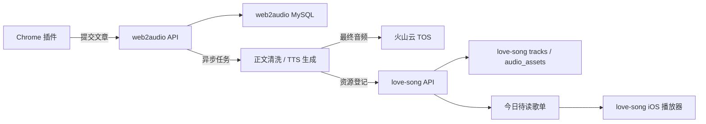
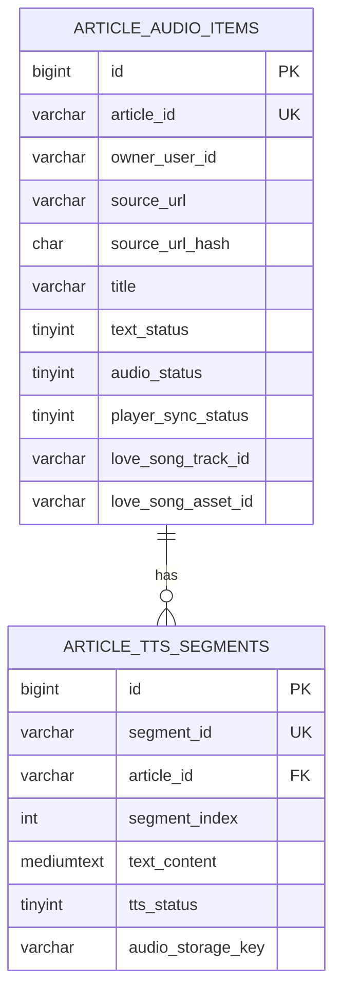
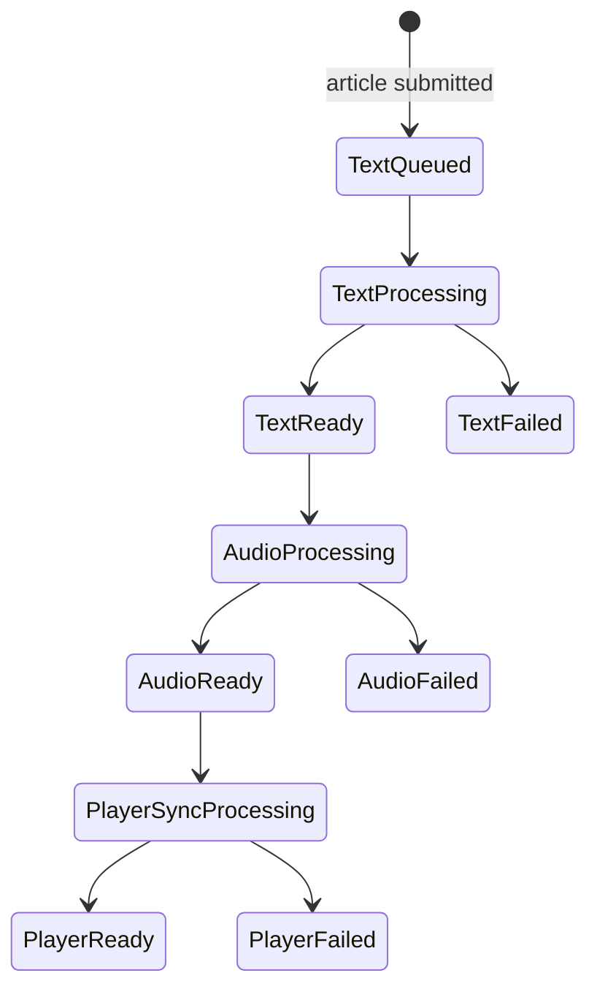
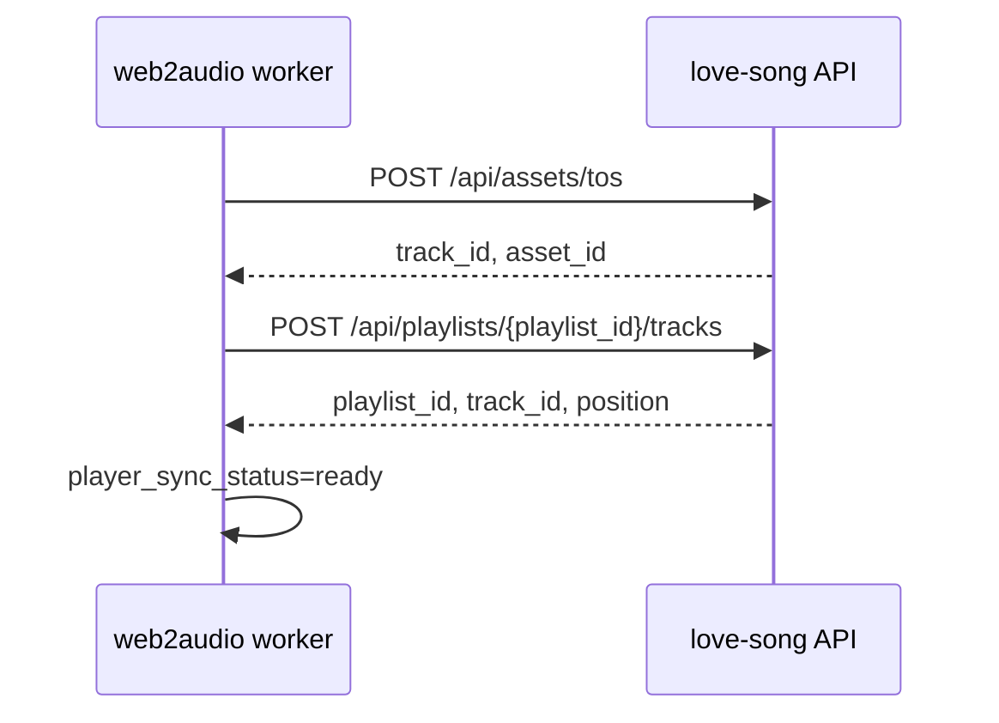

# web2audio 技术方案设计

本文档基于 `docs/PRODUCT.md`，沉淀 web2audio 第一版的技术边界、数据模型、API 契约、love-song 集成依赖和验证策略。产品目标是：Chrome 插件提交当前网页文章，web2audio 生成文章音频，音频进入 love-song 固定歌单「今日待读」，并由 love-song iOS 播放器连续播放。

## 1. 已确认事实

| 确定结论 | 依据 | 影响范围 |
| --- | --- | --- |
| 第一版只要求 iOS 播放器内连续播放文章音频 | `docs/PRODUCT.md` | 不设计后台播放、锁屏控制、CarPlay |
| Chrome 插件只在用户主动触发时提交当前网页 | `docs/PRODUCT.md` | 不设计浏览历史监听或批量导入 |
| 重复提交按原始网页 URL 精确去重 | `docs/PRODUCT.md` | 不做 canonical URL 或正文 hash 合并 |
| 文章生成完成后追加到固定歌单「今日待读」末尾 | `docs/PRODUCT.md` | web2audio 不维护独立播放顺序 |
| web2audio 与 love-song 通过 HTTP API 解耦 | 已确认产品边界 | web2audio 不直接写 love-song 数据库 |
| 第一版 TTS 生成使用豆包 lite 模型 | 已确认实现约束 | 模型和音色作为服务配置，不进入业务表结构 |
| 第一版音频对象存储使用火山云 TOS | 已确认实现约束 | web2audio 与 love-song 之间传递 TOS object key，不传云凭据 |
| love-song 当前已有歌单、播放会话、播放 URL、播放历史接口 | `/Users/bytedance/Codebases/love-song/backend/app/api/routes/*.py` | 可复用播放链路 |
| love-song 架构文档已有 TOS 音频资源登记草案，但当前路由未实现 | `/Users/bytedance/Codebases/love-song/docs/ARCHITECTURE.md`、`backend/app/api/routes/` | 需要补齐资源登记 API |

## 2. 范围

### 包含

- web2audio 文章任务、正文状态、音频生成状态和播放器同步状态的数据模型。
- Chrome 插件调用 web2audio 的文章提交和查询 API。
- web2audio 调用 love-song 的可播放资源登记和歌单追加 API。
- 固定歌单「今日待读」的追加顺序策略。
- 数据库约束、索引、状态枚举、mock 数据约束验证和 API 契约测试建议。

### 不包含

- Chrome 插件 UI 设计和浏览器权限清单。
- 豆包 lite 具体 SDK 封装和音频拼接算法。
- 后台播放、锁屏控制、CarPlay 或系统媒体中心。
- 多用户账号体系、权限管理后台和多租户隔离。
- 真实代码、migration 或接口实现。

## 3. 总体架构



关键边界：

- Chrome 插件只调用 web2audio。
- web2audio 保存文章任务和生成状态。
- web2audio 生成最终音频后，将对象存储 key 和展示元数据提交给 love-song。
- love-song 负责创建可播放 track/asset，并把 track 追加到「今日待读」。
- iOS 播放器继续调用 love-song 的播放 API，不直接使用 web2audio 生成播放 URL。

## 4. 数据库设计

### ER 关系图

ER 图只展示两张核心表的关系和关键字段；完整字段、约束和 COMMENT 备注见后续表结构。`ARTICLE_AUDIO_ITEMS` 是文章音频主表，一篇用户提交的原始网页对应一条文章任务。`ARTICLE_TTS_SEGMENTS` 是内部 TTS 分段表，用来把长文拆成多个可生成的小段，便于分段生成、合成和定位处理阶段；它不是用户可见的播放列表，也不是最终对 love-song 暴露的音频资源。



`love_song_track_id`、`love_song_asset_id` 和 `love_song_playlist_id` 是外部系统业务 ID，不在 web2audio 数据库中建立外键。

表级 COMMENT 备注：

| 表 | COMMENT 备注 | 读法 |
| --- | --- | --- |
| `article_audio_items` | 网页文章音频任务主表，记录提交来源、处理状态、最终音频和 love-song 承接结果 | 查询文章任务、去重、判断是否可播放时读这张表 |
| `article_tts_segments` | 文章 TTS 分段生成表，记录一篇文章拆分后的文本段和分段音频对象 | 仅供生成任务内部使用，最终播放仍以主表的合成音频为准 |

### 业务规则与约束依据

| 规则类型 | 设计 |
| --- | --- |
| 归属 | 第一版使用默认用户上下文，所有文章归属 `owner_user_id='default'`；后续多用户可扩展为真实用户 ID |
| 唯一性 | 同一 `owner_user_id` 下，原始网页 URL 精确去重；通过 `source_url_hash=sha256(source_url)` 建唯一约束 |
| 状态 | 正文、音频、播放器同步分开记录，避免 TTS ready 但 love-song 同步失败时状态混淆 |
| 删除 | 第一版不设计硬删除；后续删除策略需要同步考虑正文、音频对象和 love-song 可播放资源 |
| 幂等 | 文章提交以 `owner_user_id + source_url_hash` 幂等；love-song 资源登记以 `external_source + external_id` 幂等 |
| 时间 | 所有系统时间字段使用 UTC `DATETIME(6)`；API 返回 UTC ISO 8601 字符串 |

### `article_audio_items`

文章音频主表，保存文章来源、处理状态、最终音频和 love-song 承接结果。

| 字段 | 类型 | 约束 | COMMENT 备注 |
| --- | --- | --- | --- |
| `id` | `BIGINT UNSIGNED` | PK, auto increment | 内部行标识，不对外暴露 |
| `article_id` | `VARCHAR(64)` | NOT NULL, UNIQUE | 文章业务 ID，例如 `art_...` |
| `owner_user_id` | `VARCHAR(64)` | NOT NULL | 第一版固定为默认用户 |
| `source_url` | `VARCHAR(2048)` | NOT NULL | 插件提交的原始网页 URL，不做 canonical 归一 |
| `source_url_hash` | `CHAR(64)` | NOT NULL | `sha256(source_url)`，用于唯一索引 |
| `site_name` | `VARCHAR(255)` | NULL | 来源站点 |
| `author` | `VARCHAR(255)` | NULL | 作者 |
| `title` | `VARCHAR(512)` | NOT NULL | 文章标题 |
| `published_at` | `DATETIME(6)` | NULL | 原文发布时间 |
| `cover_url` | `VARCHAR(1024)` | NULL | 封面图 |
| `language` | `VARCHAR(16)` | NULL | 语言识别结果或插件提示 |
| `text_content` | `LONGTEXT` | NULL | 清洗后的正文；正文保留策略未定前允许为空 |
| `text_char_count` | `INT UNSIGNED` | NOT NULL DEFAULT 0 | 正文字数或字符数 |
| `text_status` | `TINYINT UNSIGNED` | NOT NULL DEFAULT 0 | `0-queued, 1-processing, 2-ready, 3-failed` |
| `audio_status` | `TINYINT UNSIGNED` | NOT NULL DEFAULT 0 | `0-pending, 1-processing, 2-ready, 3-failed` |
| `player_sync_status` | `TINYINT UNSIGNED` | NOT NULL DEFAULT 0 | `0-pending, 1-processing, 2-ready, 3-failed` |
| `audio_storage_key` | `VARCHAR(1024)` | NULL | 最终合成音频的对象存储 key |
| `duration_seconds` | `INT UNSIGNED` | NULL | 最终音频时长 |
| `love_song_track_id` | `VARCHAR(64)` | NULL | love-song 返回的 track ID |
| `love_song_asset_id` | `VARCHAR(64)` | NULL | love-song 返回的 asset ID |
| `love_song_playlist_id` | `VARCHAR(64)` | NULL | 固定歌单「今日待读」的 playlist ID |
| `submitted_at` | `DATETIME(6)` | NOT NULL DEFAULT current timestamp | 首次提交时间 |
| `audio_ready_at` | `DATETIME(6)` | NULL | 最终音频 ready 时间 |
| `player_synced_at` | `DATETIME(6)` | NULL | 成功追加到 love-song 时间 |
| `created_at` | `DATETIME(6)` | NOT NULL DEFAULT current timestamp | 创建时间 |
| `updated_at` | `DATETIME(6)` | NOT NULL DEFAULT current timestamp on update | 更新时间 |

约束与索引：

- `UNIQUE KEY uq_article_audio_items_article_id (article_id)`
- `UNIQUE KEY uq_article_audio_items_owner_source_hash (owner_user_id, source_url_hash)`
- `KEY idx_article_audio_items_owner_status (owner_user_id, text_status, audio_status, player_sync_status, updated_at)`
- `KEY idx_article_audio_items_love_song_track_id (love_song_track_id)`
- `CHECK (text_status IN (0, 1, 2, 3))`
- `CHECK (audio_status IN (0, 1, 2, 3))`
- `CHECK (player_sync_status IN (0, 1, 2, 3))`

服务层补充校验：

- `source_url_hash` 必须由原始 `source_url` 计算，不做 URL 参数清洗、大小写归一或 canonical 替换。
- `audio_status=ready` 时必须有 `audio_storage_key` 和 `duration_seconds`。
- `player_sync_status=ready` 时必须有 `love_song_track_id`、`love_song_asset_id` 和 `love_song_playlist_id`。
- 数据库不强制跨字段 ready 约束，避免迁移和失败恢复时被过度约束；由 service 和契约测试保护。

### `article_tts_segments`

长文分段表，用于 TTS 分段生成、合成和失败定位。最终对 love-song 暴露的仍是一条合成后的文章音频。

| 字段 | 类型 | 约束 | COMMENT 备注 |
| --- | --- | --- | --- |
| `id` | `BIGINT UNSIGNED` | PK, auto increment | 内部行标识 |
| `segment_id` | `VARCHAR(64)` | NOT NULL, UNIQUE | 分段业务 ID，例如 `seg_...` |
| `article_id` | `VARCHAR(64)` | NOT NULL | 关联 `article_audio_items.article_id` |
| `segment_index` | `INT UNSIGNED` | NOT NULL | 从 0 开始的分段顺序 |
| `text_content` | `MEDIUMTEXT` | NOT NULL | 分段文本 |
| `text_char_count` | `INT UNSIGNED` | NOT NULL DEFAULT 0 | 分段字符数 |
| `tts_status` | `TINYINT UNSIGNED` | NOT NULL DEFAULT 0 | `0-pending, 1-processing, 2-ready, 3-failed` |
| `audio_storage_key` | `VARCHAR(1024)` | NULL | 分段音频对象 key |
| `duration_seconds` | `INT UNSIGNED` | NULL | 分段音频时长 |
| `created_at` | `DATETIME(6)` | NOT NULL DEFAULT current timestamp | 创建时间 |
| `updated_at` | `DATETIME(6)` | NOT NULL DEFAULT current timestamp on update | 更新时间 |

约束与索引：

- `UNIQUE KEY uq_article_tts_segments_segment_id (segment_id)`
- `UNIQUE KEY uq_article_tts_segments_article_index (article_id, segment_index)`
- `KEY idx_article_tts_segments_article_status (article_id, tts_status, segment_index)`
- `FOREIGN KEY (article_id) REFERENCES article_audio_items(article_id) ON UPDATE CASCADE ON DELETE CASCADE`
- `CHECK (tts_status IN (0, 1, 2, 3))`

## 5. 状态流转



状态规则：

- 新文章创建后：`text_status=queued`、`audio_status=pending`、`player_sync_status=pending`。
- 正文处理成功：`text_status=ready`；正文失败：`text_status=failed`。
- 音频生成只在 `text_status=ready` 后启动；成功后写入最终音频信息并置 `audio_status=ready`。
- love-song 同步只在 `audio_status=ready` 后启动；成功后回写 `love_song_track_id`、`love_song_asset_id`、`love_song_playlist_id`。
- 用户可见的「可播放」以 `player_sync_status=ready` 为准，而不是仅以 TTS 生成完成为准。
- 失败状态只记录失败阶段，不在业务表或 API 中保存具体错误原因；排障通过任务日志按 `article_id`、`segment_id`、TTS 请求 ID 或 love-song 请求 ID 查询。

失败处理规则：

| 失败阶段 | 处理行为 |
| --- | --- |
| 正文失败 | 标记 `text_status=failed`，日志记录正文处理任务上下文 |
| TTS 失败 | 标记 `audio_status=failed`，日志记录豆包 lite 请求上下文和分段定位信息 |
| love-song 同步失败 | 标记 `player_sync_status=failed`，日志记录资源登记或歌单追加请求上下文 |
| 需要重跑 | 当前方案不定义公开重跑 API；由后端任务系统或运维动作按 `article_id` 重新投递 |

## 6. API 设计

### 统一协议

- web2audio API 使用 `/api` 前缀。
- 请求和响应使用 `application/json`。
- 字段名使用小写字母加下划线的 `snake_case` 格式，例如 `source_url`、`article_id`。
- 时间字段返回 UTC ISO 8601 字符串。
- 公开 ID 使用业务 ID，不暴露数据库自增 `id`。
- 第一版使用固定 token 鉴权，建议通过 `Authorization: Bearer <token>` 传递。

统一错误响应：

```json
{
  "error": {
    "code": "validation_failed",
    "message": "Request is invalid.",
    "details": {}
  }
}
```

通用错误：

| 场景 | HTTP | code |
| --- | ---: | --- |
| 请求体格式或字段非法 | 422 | `validation_failed` |
| 未提供或 token 无效 | 401 | `unauthorized` |
| 文章不存在 | 404 | `article_not_found` |
| TTS 依赖失败 | 502 | `tts_provider_unavailable` |
| love-song 依赖失败 | 502 | `love_song_unavailable` |

### `POST /api/articles`

Chrome 插件提交当前网页文章。该接口按 `owner_user_id + source_url` 精确幂等。

请求：

```json
{
  "source_url": "https://mp.weixin.qq.com/s/sVgTl03Hh3zaNFBh7X-ckQ",
  "title": "示例文章标题",
  "text_content": "Clean article body from extension.",
  "site_name": "Example",
  "author": "Author",
  "published_at": "2026-06-27T08:00:00Z",
  "cover_url": "https://example.com/cover.jpg",
  "language_hint": "zh"
}
```

字段规则：

| 字段 | 规则 |
| --- | --- |
| `source_url` | 必填，`http` 或 `https`，最大 2048 字符；按原值精确去重 |
| `title` | 必填，最大 512 字符 |
| `text_content` | 必填，第一版最大 300000 字符；为空或过短返回 `validation_failed` |
| `site_name` | 可选，最大 255 字符 |
| `author` | 可选，最大 255 字符 |
| `published_at` | 可选，UTC ISO 8601 |
| `cover_url` | 可选，最大 1024 字符 |
| `language_hint` | 可选，最大 16 字符 |

新建响应 `201 Created`：

```json
{
  "article_id": "art_...",
  "created": true,
  "source_url": "https://mp.weixin.qq.com/s/sVgTl03Hh3zaNFBh7X-ckQ",
  "title": "示例文章标题",
  "status": "submitted",
  "text_status": "queued",
  "audio_status": "pending",
  "player_sync_status": "pending",
  "submitted_at": "2026-06-27T08:00:00Z"
}
```

重复提交响应 `200 OK`：

```json
{
  "article_id": "art_...",
  "created": false,
  "source_url": "https://mp.weixin.qq.com/s/sVgTl03Hh3zaNFBh7X-ckQ",
  "title": "示例文章标题",
  "status": "processing",
  "text_status": "ready",
  "audio_status": "processing",
  "player_sync_status": "pending",
  "submitted_at": "2026-06-27T08:00:00Z"
}
```

### `GET /api/articles/{article_id}`

查询文章任务详情，供插件状态页或后续文章列表使用。

响应：

```json
{
  "article_id": "art_...",
  "source_url": "https://mp.weixin.qq.com/s/sVgTl03Hh3zaNFBh7X-ckQ",
  "title": "示例文章标题",
  "site_name": "Example",
  "author": "Author",
  "published_at": "2026-06-27T08:00:00Z",
  "cover_url": "https://example.com/cover.jpg",
  "language": "zh",
  "status": "playable",
  "text_status": "ready",
  "audio_status": "ready",
  "player_sync_status": "ready",
  "duration_seconds": 1200,
  "love_song_track_id": "track_...",
  "love_song_asset_id": "ast_...",
  "love_song_playlist_id": "pl_...",
  "submitted_at": "2026-06-27T08:00:00Z",
  "updated_at": "2026-06-27T08:15:00Z"
}
```

`status` 是面向客户端展示的派生状态：

| `status` | 推导 |
| --- | --- |
| `submitted` | 正文尚未开始处理 |
| `processing` | 正文、音频或播放器同步任一阶段处理中，或上游阶段 ready 后等待下游异步任务启动 |
| `playable` | `player_sync_status=ready` |
| `failed` | 任一阶段失败 |

### `GET /api/articles`

分页查询文章任务。

Query：

| 参数 | 类型 | 默认 | 说明 |
| --- | --- | ---: | --- |
| `page` | int | 1 | 从 1 开始 |
| `page_size` | int | 20 | 最大 100 |
| `status` | string | 无 | `submitted`、`processing`、`playable`、`failed` |
| `source_url` | string | 无 | 精确查询原始网页 URL |

响应：

```json
{
  "items": [],
  "page": 1,
  "page_size": 20,
  "total": 0
}
```

默认排序：`submitted_at DESC`。

## 7. love-song 集成契约

### 现有可复用接口

| 能力 | love-song 现有接口 | web2audio 用法 |
| --- | --- | --- |
| 查询歌单 | `GET /api/playlists` | 定位或校验「今日待读」 |
| 创建歌单 | `POST /api/playlists` | 只用于人工初始化「今日待读」，不由同步 worker 自动调用 |
| 追加曲目到歌单 | `POST /api/playlists/{playlist_id}/tracks` | 将文章 track 追加到歌单末尾 |
| iOS 播放会话 | `POST /api/playback-sessions` | iOS 播放器使用 |
| 播放 URL | `POST /api/playback-url` | iOS 播放器使用 |
| 播放历史 | `POST /api/play-history` | iOS 播放器使用 |

`web2audio` 不调用播放会话、播放 URL 和播放历史接口；这些仍由 love-song iOS 播放器调用。

### 需要 love-song 补齐的资源登记接口

love-song 当前架构文档已有 `POST /api/assets/tos` 草案，但当前代码未实现。web2audio 第一版需要一个幂等的火山云 TOS 可播放资源登记能力。

跨工程落地方式：

| 阶段 | web2audio | love-song |
| --- | --- | --- |
| 契约定稿 | 在本文档维护调用方需要的 request、response、幂等和错误语义 | 在 love-song 的架构或 API 规格文档同步同一份契约 |
| 先后顺序 | 在 love-song 路由未完成前，web2audio 使用 fake love-song client 做契约测试 | 先补齐 `POST /api/assets/tos` 路由、service、schema 和测试 |
| 集成验证 | 只通过 HTTP 调用 love-song，不直接写 love-song 数据库 | 保证 track 与 audio asset 在同一事务中创建，并返回稳定业务 ID |
| 上线边界 | 配置 love-song base URL、固定 playlist ID 和服务 token | 暴露幂等资源登记能力，并继续由 iOS 使用现有播放 API |

建议契约：`POST /api/assets/tos`

请求：

```json
{
  "external_source": "web2audio",
  "external_id": "art_...",
  "content_type": "article_audio",
  "title": "示例文章标题",
  "subtitle": "Example",
  "cover_url": "https://example.com/cover.jpg",
  "duration_seconds": 1200,
  "storage_key": "web2audio/articles/art_xxx/final.mp3",
  "mime_type": "audio/mpeg"
}
```

响应 `201 Created` 或幂等命中 `200 OK`：

```json
{
  "track_id": "track_...",
  "asset_id": "ast_...",
  "content_type": "article_audio",
  "title": "示例文章标题",
  "subtitle": "Example",
  "source_type": "tos"
}
```

契约要求：

- `external_source + external_id` 幂等；重复登记同一文章返回同一个 `track_id` 和 `asset_id`。
- love-song 内部创建 track 与 audio asset 必须在同一事务内完成。
- `content_type=article_audio` 用于 iOS 避免展示「未知艺术家」「首歌」等音乐文案。
- `subtitle` 第一版使用文章来源站点。
- `mime_type` 可由 web2audio 按最终产物固定传 `audio/mpeg`；web2audio 不在业务表中单独持久化该字段。
- web2audio 不传火山云 TOS AK/SK，只传对象 key 和展示元数据。

### 「今日待读」歌单定位

当前方案：

1. love-song 预置系统托管歌单「今日待读」，并将固定 `playlist_id` 配置到 web2audio。
2. web2audio 启动或同步前校验 `playlist_id` 可访问；未配置或不可访问时，视为配置错误，不自动按名称创建歌单。
3. 人工初始化可使用 `POST /api/playlists` 创建「今日待读」，但初始化完成后仍以固定 `playlist_id` 作为运行时依赖。
4. `POST /api/playlists/{playlist_id}/tracks` 返回 `409 track_already_in_playlist` 时，如果是同一文章对应 track，web2audio 按幂等成功处理。

### 同步流程



失败处理：

| 失败点 | 处理 |
| --- | --- |
| 资源登记超时或 5xx | `player_sync_status=failed`，日志记录 love-song 请求 ID 和 HTTP 状态 |
| 资源登记 4xx | 标记 failed，日志记录可读错误码，需人工排查元数据或配置 |
| 歌单追加重复 | 视为幂等成功 |
| 歌单不存在 | 标记 failed，按配置错误处理 |

## 8. mock 数据导入验证

### Accepted mock rows

| 数据 | 预期 |
| --- | --- |
| 新文章 `source_url=https://mp.weixin.qq.com/s/sVgTl03Hh3zaNFBh7X-ckQ` | 写入 `article_audio_items`，状态为 `queued/pending/pending` |
| 同一文章生成 3 个分段 | 写入 `article_tts_segments`，`segment_index` 为 0、1、2 |
| 音频生成完成 | 主表写入最终 `audio_storage_key`、`duration_seconds`，`audio_status=ready` |
| love-song 同步完成 | 主表写入 `love_song_track_id`、`love_song_asset_id`、`love_song_playlist_id`，`player_sync_status=ready` |

### Rejected mock rows

| 数据 | 失败层级 | 原因 |
| --- | --- | --- |
| 同一 `owner_user_id` 下重复 `source_url_hash` | 数据库 | 命中唯一约束 |
| 非法 `text_status=9` | 数据库 | 命中 CHECK 约束 |
| 分段引用不存在的 `article_id` | 数据库 | 命中外键约束 |
| 同一文章重复 `segment_index` | 数据库 | 命中组合唯一约束 |
| `audio_status=ready` 但无最终音频 key | service | 数据库不做跨字段 ready 约束 |
| `player_sync_status=ready` 但无 love-song 返回 ID | service | 数据库不做跨字段 ready 约束 |

### Constraint gaps

- 数据库不校验 URL 是否可访问，只校验长度和唯一性。
- 数据库不校验正文长度上下限，由 API 和 service 负责。
- 数据库不校验火山云 TOS object 是否存在，由 storage adapter 和 love-song 播放 URL 校验负责。
- 数据库不保证 love-song 外部 ID 真实存在，由同步任务和日志排障负责。

## 9. 兼容性与迁移影响

### web2audio

- 当前仓库尚无代码和 schema，新增表为首次建模，无存量迁移压力。
- `feature_list.json` 中 `feat-002` 到 `feat-004` 需要按本方案拆分实施。
- `init.sh` 后续需要补充后端测试、schema 校验、API 契约测试和插件构建检查。

### love-song

- 现有歌单与播放 API 可复用。
- 需要补齐 TOS 资源登记 API，并确保 `external_source + external_id` 幂等。
- 为避免文章被展示为普通音乐，love-song API/iOS 需要识别 `content_type=article_audio`，并优先展示文章标题和来源站点。
- 如果 love-song 继续只返回现有音乐 DTO，短期可把 `subtitle` 映射为来源站点，但这不能完全解决「首歌」等文案问题。

## 10. 契约测试与验证命令

### web2audio API 契约测试

- `POST /api/articles` 新文章返回 `201` 和 `created=true`。
- 同一 `source_url` 重复提交返回 `200` 和 `created=false`。
- 非法 URL、空正文、未知字段、非法时间格式返回 `422 validation_failed`。
- 无 token 或错误 token 返回 `401 unauthorized`。
- `GET /api/articles/{article_id}` 对不存在文章返回 `404 article_not_found`。
- `status=processing` 覆盖下游异步任务尚未启动的等待态，例如正文 ready 但音频仍 pending。

### 数据库约束测试

- 重复 `owner_user_id + source_url_hash` 被拒绝。
- 非法 tinyint 状态被拒绝。
- 分段孤儿行被拒绝。
- 同一文章重复 `segment_index` 被拒绝。
- ready 跨字段约束由 service 测试覆盖。

### love-song 集成测试

- fake love-song 返回资源登记成功后，web2audio 写入 `love_song_track_id` 和 `love_song_asset_id`。
- fake love-song 歌单追加成功后，`player_sync_status=ready`。
- fake love-song 返回重复追加时，web2audio 视为成功。
- fake love-song 5xx 时，web2audio 标记 `player_sync_status=failed`，并能通过日志定位请求上下文。

### 端到端验收

1. 插件提交一篇普通文章。
2. web2audio 返回文章任务。
3. TTS 任务生成最终音频。
4. web2audio 调用 love-song 完成资源登记。
5. web2audio 将 track 追加到「今日待读」。
6. love-song iOS 播放器打开「今日待读」并连续播放文章音频。

当前仓库只有文档和 harness，文档阶段验证命令为：

```bash
./init.sh
```

## 11. 待确认项

| 问题 | 默认建议 | 影响 |
| --- | --- | --- |
| 豆包 lite 模型配置 | 通过运行时配置管理具体 model id、音色和服务凭据 | 影响 TTS client 配置、日志字段和外部依赖错误码 |
| 正文保留策略 | 第一版保留清洗正文，后续支持删除 | 影响 `text_content` 是否可为空及清理任务 |
| love-song 资源登记 API 最终路径 | 使用 `POST /api/assets/tos` 登记火山云 TOS object | 影响 web2audio love-song client |
| 「今日待读」playlist_id 来源 | 优先配置固定 playlist ID | 避免按名称搜索产生歧义 |
| iOS 文章文案改造方式 | love-song 返回 `content_type=article_audio` 和 `subtitle` | 影响 iOS DTO 与展示逻辑 |
